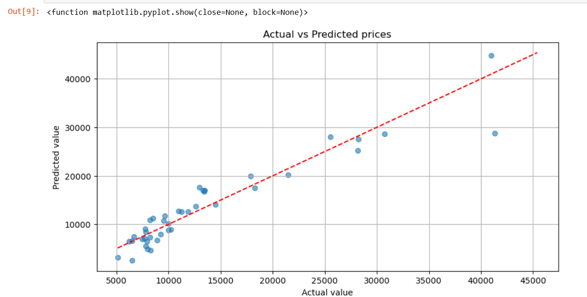

# BLENDED_LERNING
# Implementation-of-Multiple-Linear-Regression-Model-with-Cross-Validation-for-Predicting-Car-Prices

## AIM:
To write a program to predict the price of cars using a multiple linear regression model and evaluate the model performance using cross-validation.

## Equipments Required:
1. Hardware – PCs
2. Anaconda – Python 3.7 Installation / Jupyter notebook

## Algorithm
1. Import Libraries: Bring in the necessary libraries.
2. Load the Dataset: Load the dataset into your environment.
3. Data Preprocessing: Handle any missing data and encode categorical variables as needed.
4. Define Features and Target: Split the dataset into features (X) and the target variable (y).
5. Split Data: Divide the dataset into training and testing sets.
6. Build Multiple Linear Regression Model: Initialize and create a multiple linear regression model.
7. Train the Model: Fit the model to the training data.
8. Evaluate Performance: Assess the model's performance using cross-validation.
9. Display Model Parameters: Output the model’s coefficients and intercept.
10. Make Predictions & Compare: Predict outcomes and compare them to the actual values.
## Program:
```
/*
Program to implement the multiple linear regression model for predicting car prices with cross-validation.
Developed by: N P YOGESH
RegisterNumber:  212225240189
*/

import pandas as pd
from sklearn.model_selection import train_test_split,cross_val_score
from sklearn.linear_model import LinearRegression
from sklearn.metrics import mean_squared_error,r2_score
import matplotlib.pyplot as plt

#LOAD DATA
data=pd.read_csv('CarPrice_Assignment (1).csv')

#simple preprocessing
data=data.drop(['car_ID','CarName'],axis=1)
data=pd.get_dummies(data,drop_first=True)

#split data
x=data.drop('price',axis=1)
y=data['price']
x_train,x_test,y_train,y_test=train_test_split(x,y,test_size=0.2,random_state=42)


#training
model=LinearRegression()
model.fit(x_train,y_train)

#Model coefficients and metrics
print('Name:N.P,YOGESH')
print('Reg No:212225240189')
print('\n== Cross-Validation ===')
cv_score= cross_val_score(model,x,y,cv=5)
print("fold r2 Scores:",[f"{score:4f}" for score in cv_score])
print(f"Average R2: {cv_score.mean():4f}")

#test set
y_pred=model.predict(x_test)
print("\n== Test set Perfornamce ===")
print(f"MSE: {mean_squared_error(y_test,y_pred):.2f}")
print(f"R2: {r2_score(y_test,y_pred):.4f}")

plt.figure(figsize=(10,5))
plt.scatter(y_test,y_pred,alpha=0.6)
plt.plot([y.min(),y.max()],[y.min(),y.max()],'r--')
plt.title("Actual vs Predicted prices")
plt.xlabel("Actual value")
plt.ylabel("Predicted value")
plt.grid(True)
plt.show
```
## Output:




## Result:
Thus, the program to implement the multiple linear regression model with cross-validation for predicting car prices is written and verified using Python programming.
